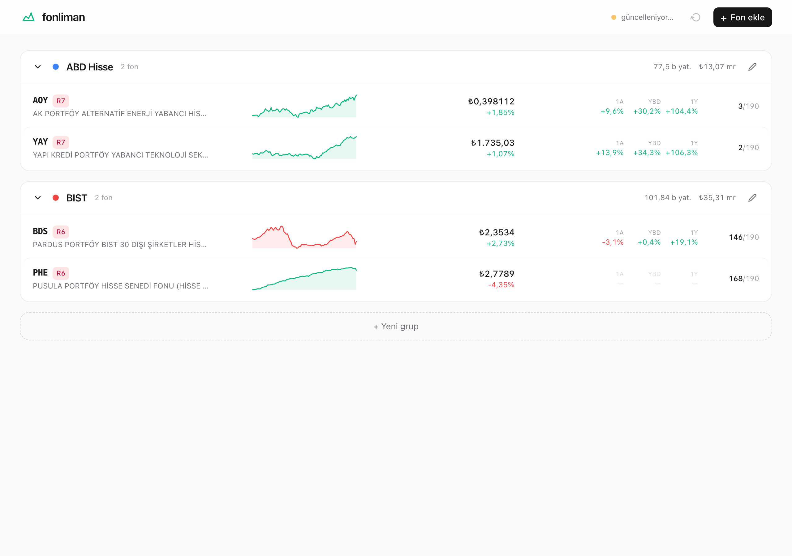
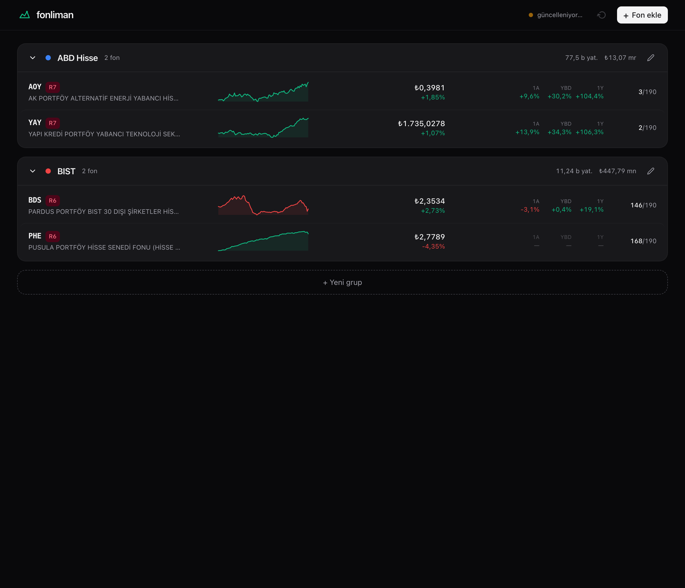
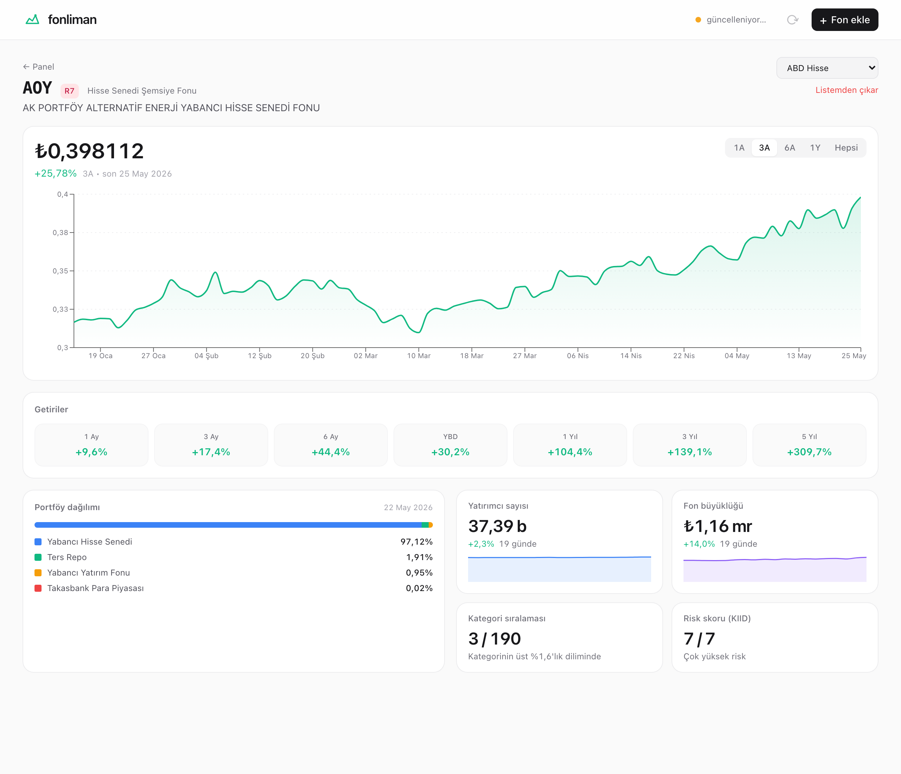
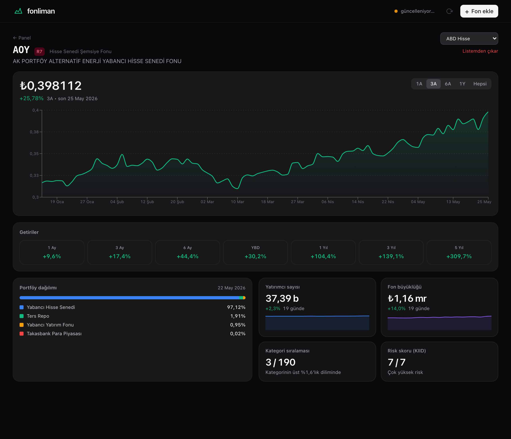

# fonliman

> **TEFAS fonlarını tek ekranda takip et.** Sade, hızlı, kendi makinende.
> _Self-hosted dashboard for tracking Turkish (TEFAS) investment funds._

Kendi izlediğin fonların günlük getirisini, kategori sıralamasını, yatırımcı
sayısını, fon büyüklüğünü ve portföy dağılımını **bir ekrandan** görmeni
sağlar. TEFAS sitesinde fon fon dolaşmak zorunda kalmazsın.

Veri senin makinende durur, hesap istemez, ücret istemez.



---

## Neden yazdım?

TEFAS'ta birden çok fonu takip ediyorsan, her birine ayrı ayrı bakmak gerek.
Soru basit aslında:

- Bugün portföyüm ne durumda?
- Hangi fonum kategorisinde nerede?
- Yatırımcı sayısı, fon büyüklüğü nasıl evrildi?
- Bu fon hangi varlıkları tutuyor — hisse mi, repo mu, altın mı?

`fonliman` bu sorulara tek bakışta cevap verir.

## Özellikler

- **Gruplu panel.** Kendi gruplamanı kur (ABD Hisse, BIST, Para Piyasası, Altın…). Her grupta fonların satır halinde: fiyat, sparkline, günlük/aylık/yıllık getiri, KIID risk skoru, kategori sıralaması.
- **Görsel detay sayfası.** Büyük interaktif NAV grafiği (1A / 3A / 6A / 1Y / Hepsi). Hover'da günlük fiyat. 50+ varlık sınıfına dökülmüş portföy dağılımı. Yatırımcı sayısı + AUM trend grafikleri.
- **Akıllı stat-box'lar.** Sabit kalan verilere boş grafik çizmiyor — onun yerine büyük rakam + altyazı gösteriyor. Örnek: "Kategori sıralaması 3 / 190 — kategorinin üst %1,6'lık diliminde".
- **Otomatik güncelleme.** Her gün 22:30'da (İstanbul) TEFAS'tan veri çeker. App'i açtığında varsa kaçırdığın günleri otomatik backfill eder. Manuel "şimdi güncelle" butonu da var.
- **Tatil günlerinde uyanık.** Türk milli + dini bayramları + hafta sonlarını biliyor, boşa istek atmıyor.
- **Apple-tarzı arayüz.** Tabular figures, sistem fontu, light/dark otomatik. Para formatı magnitude'a göre değişir (₺0,398112 / ₺1.735,03 / ₺1,16 mr).
- **macOS launcher.** `Cmd+Space → "fonliman" → Enter` ile bir tıkta açılır.

## Hızlı kurulum

Tek komut, her şey hazır:

```bash
git clone https://github.com/tanyelai/fonliman.git
cd fonliman
bash setup.sh
```

`setup.sh` Docker imajını build eder, container'ı kaldırır, hazır olduğunda
tarayıcıda `localhost:8765`'i açar. macOS'taysan ayrıca Spotlight launcher'ını
kurar — `Cmd+Space → "fonliman"` ile bir daha terminale girmen gerekmez.

İlk çalıştırma 2-3 dakika sürer (Docker imajı build edilir). Sonraki açılışlar
hızlıdır.

### Sağ üstten **+ Fon ekle** ile başlarsın

TEFAS kodunu yaz (örn. `AOY`, `BDS`, `TP2`) — fon TEFAS'ta varsa anlık önizleme
çıkar. Bir grup seç, **Ekle** de. Geri kalan veri arkada çekilir, 10 saniye
içinde dashboard'da boy gösterir.

### Port çakışması olursa

8765 sende kullanılıyorsa `.env` ile değiştir:

```bash
echo "PORT=9876" > .env
docker compose up -d
```

### Veri nereye gidiyor?

`./data/fonliman.db` SQLite dosyası volume olarak container'ın dışında durur.
Container'ı silsen bile verin yerinde kalır.

## Ekran görüntüleri

| Light | Dark |
|---|---|
|  |  |
|  |  |

## Nasıl çalışıyor?

```
       ┌──────────────────────────┐
       │  Docker container        │
       │  ┌────────────────────┐  │
       │  │  FastAPI (Python)  │  │
       │  │  /api/groups       │  │
       │  │  /api/funds        │  │
       │  │  /api/dashboard    │  │
       │  │  /api/refresh      │  │
       │  │  /     (React SPA) │  │
       │  ├────────────────────┤  │
       │  │  APScheduler       │  │
       │  │  her gün 22:30 IST │  │
       │  ├────────────────────┤  │
       │  │  TEFAS client      │──┼──→ tefas.gov.tr
       │  ├────────────────────┤  │
       │  │  SQLite (volume)   │  │
       │  └────────────────────┘  │
       └──────────────────────────┘
              ↓ :8765
         http://localhost
```

### Güncelleme nasıl tetikleniyor?

Üç yolla:

1. **Açılışta catch-up.** Uygulamayı çalıştırdığında elindeki son veriden bugüne kadar eksik günleri otomatik çekiyor. Mac günlerce kapalı kaldıysa bile bir sonraki açılışta her şey güncel olur.
2. **Günlük zamanlayıcı.** Her gün 22:30 İstanbul saatinde. Tatil günlerinde tetiklenmiyor.
3. **Manuel.** Header'daki ↻ butonu.

Aynı günü 100 kez çeksen bile veri çift kaydedilmiyor (idempotent UPSERT).

### TEFAS endpoint'leri

TEFAS'ın 2026'da yenilenen public JSON API'sini kullanıyor. Auth/key gerekmez:

| Endpoint | Verdiği |
|---|---|
| `/api/funds/fonGetiriBazliBilgiGetir` | 1009 fonun pre-computed getirileri (1A/3A/6A/YBD/1Y/3Y/5Y), risk skoru, kategori |
| `/api/funds/fonFiyatBilgiGetir` | Tek fon için NAV history + kategori sıralaması (5 yıla kadar) |
| `/api/funds/fonGnlBlgSiraliGetir` | Tek fon için günlük NAV + yatırımcı sayısı + AUM + pay sayısı |
| `/api/funds/dagilimSiraliGetirT` | Portföy dağılımı (58 varlık sınıfı) |

TEFAS rate-limit uyguluyor — uygulama exponential backoff yapıp arada bekliyor.

## Yapılandırma

Her şey ortam değişkeniyle (`.env` veya `docker compose` `environment` bölümü):

| Değişken | Varsayılan | Açıklama |
|---|---|---|
| `PORT` | `8765` | HTTP portu |
| `FONLIMAN_DATA_DIR` | `/data` | SQLite dosyasının durduğu klasör (Docker'da volume) |
| `FONLIMAN_SYNC_HOUR` | `22` | Günlük senkron saati (İstanbul) |
| `FONLIMAN_SYNC_MINUTE` | `30` | Günlük senkron dakikası |

## Sık sorulan sorular

**Verim sızar mı?**
Hayır. Her şey lokalde çalışıyor, hiçbir 3. parti servise veri yollamıyor. Sadece TEFAS'ın kendi public endpoint'lerine istek atıyor.

**TEFAS hesabım gerek mi?**
Hayır. TEFAS public endpoint'lerini auth olmadan kullanıyor — TEFAS sitesi de aynısını yapıyor.

**Fiyatlar ne sıklıkla güncelleniyor?**
TEFAS fon NAV'larını günde bir kez, akşam (~21:30 IST civarı) yayımlıyor. Intraday güncelleme yok. fonliman 22:30'da güvenli aralıkta veri çekiyor.

**Mac uykudaysa fiyat kaçırır mıyım?**
Kısa cevap: hayır. Sonradan açtığında catch-up otomatik backfill yapıyor.

**Birden çok portföy için kullanılır mı?**
Şu an tek kullanıcı için. Birden çok profil istersen ayrı container kaldırabilirsin (farklı `PORT`, ayrı `data/` dizini).

**Hisse fonum için hangi şirketleri tuttuğunu görebilir miyim?**
TEFAS'ın public API'sinde sadece varlık sınıfı bazında dağılım var (hisse %X, yabancı hisse %Y) — spesifik hisse adları yok. Bu Faz 3 yol haritasında, KAP entegrasyonu gerekecek.

**E-posta özet var mı?**
Henüz yok, yol haritasında. Şimdilik app'i açınca "on-open digest" düşünülüyor.

## Yol haritası

- [ ] Hedef ağırlık drift uyarısı (gruba `target_pct` set ettiğinde portföy dağılımı kaymışsa görsel sinyal)
- [ ] Günlük/haftalık özet sayfası — "dün ne oldu", "geçen hafta ne oldu"
- [ ] Opsiyonel SMTP e-posta gönderimi
- [ ] Hisse fonları için top N pozisyon (KAP entegrasyonu)
- [ ] Yönetim ücreti şeffaflığı
- [ ] Benchmark karşılaştırma (BIST100, S&P500, TLREF)
- [ ] CSV export
- [ ] Stopaj sonrası net getiri

## Katkıda bulunmak

Bug bildirimi, özellik önerisi, kod katkısı — üçü de açık. Geliştirme ortamı kurulumu, kod konvansiyonları ve PR akışı: [CONTRIBUTING.md](CONTRIBUTING.md).

## Teşekkür

- **TEFAS / Takasbank** — public veri sağladıkları için. https://tefas.gov.tr
- **[burakyilmaz321/tefas-crawler](https://github.com/burakyilmaz321/tefas-crawler)** ve **[mirzazad/pytefas](https://github.com/mirzazad/pytefas)** — TEFAS API'sini açan referans implementasyonlar.

## Lisans

[MIT](LICENSE). TEFAS verileri Takasbank'a aittir — bu proje sadece kendi makinende kişisel kullanım için bir okuma aracıdır.

---

> [Toygar Tanyel](https://github.com/tanyelai) tarafından yazıldı. Issue ve PR'larınızı bekliyorum.
